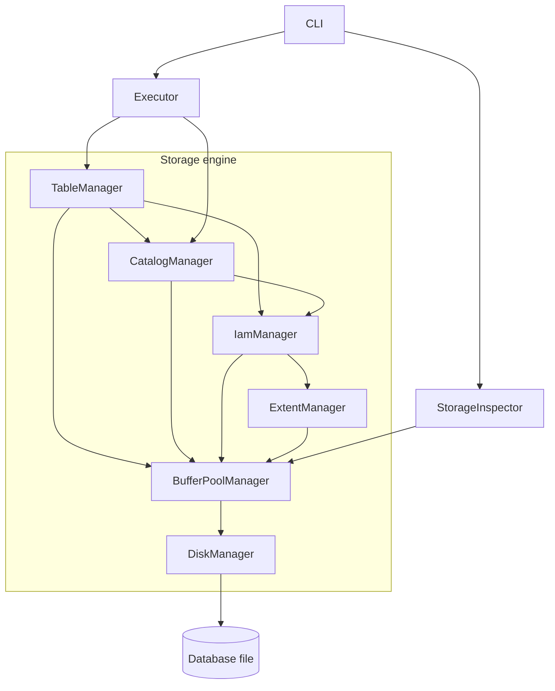

# LettyDB

LettyDB is a disk-based relational database written from scratch in C++17 to explore how databases work internally. It implements its own SQL frontend, page storage, buffer pool, allocation maps, catalog, and query executor. Only external dependencies are added to support the CLI, logging, formatting, and tests. The core functionality of this database is implemented without any external libraries

**Current milestone: [`v0.5-compact-table`](https://github.com/amitvc/lettydb/tree/v0.5-compact-table).** You can create tables, insert and query rows, delete data, compact tables, and inspect the underlying storage from the CLI. Write-ahead logging (WAL) is the current development focus. Transactions and crash recovery are not available yet.

## Terminal demo

[](https://asciinema.org/a/Tx3rZ8HmkLZCBHQ2)

Watch the 35-second walkthrough: create a table, insert and filter rows, delete, compact, inspect storage, and reopen the database.

You can also download the [recording](demo.cast) and play it locally:

```sh
asciinema play demo.cast
```

## What has been built

| Component | Current capabilities |
| --- | --- |
| SQL frontend | Handwritten lexer and recursive descent parser producing an abstract syntax tree (AST). |
| Disk storage | 4 KiB pages, slotted pages for tuples, and allocation in extents of 8 pages. |
| Buffer pool | Page caching, pin/unpin tracking, dirty-page flushing, LRU eviction, and cache statistics. |
| Allocation maps | Global Allocation Maps (GAM) track free extents; Index Allocation Maps (IAM) track the extents owned by each table. |
| Catalog | Persistent table definitions and schemas, loaded when reopening a database. |
| Query execution | `CREATE TABLE`, multi-row `INSERT`, single-table `SELECT` with column projection and `WHERE`, and `DELETE` with optional filtering. |
| Space reclamation | `COMPACT TABLE` repacks live tuples and releases unused extents for reuse. |
| CLI and inspection | Interactive SQL, command history, keyword completion, formatted results, and storage inspection commands. |

### Components

`DatabaseEngine` wires the components together. This diagram shows their main relationships; all page access goes through `BufferPoolManager`.



The inspector also reads metadata from the catalog and allocation managers. The buffer pool uses LRU eviction to make room for pages as needed.

## Milestone tags

Each tag marks a working stage of the database's development.

| Tag | Milestone |
| --- | --- |
| [`v0.1-sql-frontend`](https://github.com/amitvc/lettydb/tree/v0.1-sql-frontend) | SQL lexer, recursive descent parser, and AST generation. |
| [`v0.2-storage-engine`](https://github.com/amitvc/lettydb/tree/v0.2-storage-engine) | Storage layer: buffer pool, extent allocation, IAM, and table management. |
| [`v0.3-query-execution`](https://github.com/amitvc/lettydb/tree/v0.3-query-execution) | Scanner-based table reads, `SELECT` projection, and `WHERE` filtering. |
| [`v0.4-delete-query`](https://github.com/amitvc/lettydb/tree/v0.4-delete-query) | `DELETE` with `WHERE`, plus `IS NULL` and `IS NOT NULL` predicates. |
| [`v0.5-compact-table`](https://github.com/amitvc/lettydb/tree/v0.5-compact-table) | Table compaction with tuple migration and extent reclamation through GAM. |

To explore a specific milestone, check out its tag before configuring and building:

```sh
git checkout v0.5-compact-table
```

The usage examples below target the current milestone. Earlier tags have fewer capabilities.

## Build

Prerequisites:

- A C++17 compiler and a POSIX environment, such as macOS or Linux.
- CMake 3.22 or newer, Make, and Git.
- Network access on the first configuration to download dependencies.
- Optional: Doxygen and Graphviz for API documentation and diagrams.

CMake downloads spdlog, replxx, nlohmann/json, tabulate, and GoogleTest automatically.

```sh
git clone https://github.com/amitvc/lettydb.git
cd lettydb
cmake --preset debug
cmake --build --preset debug
```

For a release build, use `cmake --preset release` followed by `cmake --build --preset release`. Its executable is placed in `cmake-build-release/`.

## Use LettyDB

Start the CLI with a new or existing database file:

```sh
./cmake-build-debug/lettydb_cli demo.db
```

If no path is supplied, the CLI uses `letty.db` in the current directory. Reopen the same path to access saved tables and rows after a normal shutdown. Command history is stored in `<database-path>.history`, and diagnostic logs are written to `letty.log` in the current directory.

Enter **one complete SQL statement per line**. The CLI does not accumulate multiline statements. Use `help` or `\h` for help, and `exit`, `quit`, or `\q` to close it.

### Try a complete session

Run these statements in a fresh database:

```sql
CREATE TABLE users (id INT NOT NULL, name VARCHAR(50) NOT NULL, age INT, active BOOL);
INSERT INTO users VALUES (1, 'Ada', 36, true), (2, 'Grace', 45, true), (3, 'Linus', NULL, false);
SELECT * FROM users;
SELECT name, age FROM users WHERE age >= 40 AND active = true;
SELECT name FROM users WHERE age IS NULL;
DELETE FROM users WHERE active = false;
COMPACT TABLE users;
SELECT id, name FROM users;
```

The filtered queries return Grace and Linus, respectively. After deletion and compaction, Ada and Grace remain. Compaction reports tuples migrated, extents freed, and pages reclaimed; a small table may have no extents to release. Freed extents are available for reuse within the database, rather than shrinking the database file.

Exit and reopen `demo.db`, then run `SELECT * FROM users;` to see the retained rows.

### Inspect storage

These are CLI commands, so enter them **without a trailing semicolon**:

```text
INSPECT SUMMARY
INSPECT GAM
INSPECT TABLE users
```

Use a data page ID from `INSPECT TABLE users` to inspect its contents. For example, if the reported range is `56–63`, run `INSPECT PAGE 56 users`.

| Command | Shows |
| --- | --- |
| `INSPECT SUMMARY` | Physical and logical storage sizes, extent allocation, and buffer-pool statistics. |
| `INSPECT GAM` | Global extent allocation bitmap. |
| `INSPECT TABLE users` | The table's IAM chain and owned extents. |
| `INSPECT PAGE <page_id>` | Page details and a hex dump. |
| `INSPECT PAGE <page_id> users` | Page details with tuples decoded using the table's schema; choose a data page belonging to that table. |

### IDE consoles and redirected input

Use `--simple` to disable the interactive line editor:

```sh
./cmake-build-debug/lettydb_cli demo.db --simple
```

You can also redirect a file containing one statement per line:

```sh
./cmake-build-debug/lettydb_cli demo.db --simple < queries.sql
```

Redirected input still produces CLI banners, prompts, and formatted results.

## SQL support and current limits

- `INSERT` accepts multiple rows and explicit column lists. Omitted nullable columns become `NULL`; `NOT NULL` columns require values.
- `SELECT` supports `*` or named columns from a single table. `WHERE` supports `=`, `!=`, `<`, `<=`, `>`, `>=`, `AND`, `OR`, parentheses, `IS NULL`, and `IS NOT NULL`.
- `DELETE FROM table_name` deletes every row; add `WHERE` to delete matching rows only.
- Queries use table scans. Indexes and a query optimizer are not implemented.
- Parser support is broader than execution support. `UPDATE`, `DROP TABLE`, and `CREATE INDEX` are not executable. Joins, grouping, aggregates, and primary-key enforcement are not implemented, even where syntax is recognized.
- The database does not yet provide transactions, rollback, crash recovery, or full ACID guarantees. Persistence across normal shutdowns is implemented.

## What is next

The immediate focus is **write-ahead logging and recovery**: implementing log records and durable append/read operations, integrating logging with page changes and flushing, and using the log to recover after an interrupted process. WAL work is in progress and is not part of the completed milestones above.

Longer-term goals include:

- Transaction management and the remaining ACID guarantees.
- B+ tree indexing and query optimization.
- Broader SQL execution support.
- A TCP client/server interface for remote connections.

## Tests and API documentation

Run the test suite after building:

```sh
ctest --preset debug --output-on-failure
```

The tests cover the SQL frontend and executor, catalog, storage pages, tuple serialization, buffer pool and LRU replacement, extent and IAM allocation, and compaction. The suite also includes stress tests and buffer-pool benchmarks.

With Doxygen and Graphviz installed before configuration, generate API documentation with:

```sh
cmake --build --preset docs
```

Open `cmake-build-debug/docs/html/index.html` to browse it.
